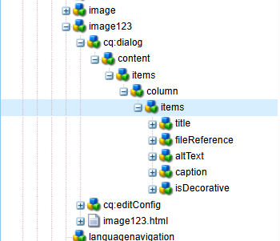

# AEM Component & Clientlib Generator

A powerful VS Code extension that accelerates AEM component development by generating complete component structures with TouchUI dialogs, Sightly/HTL templates, and proper `sling:resourceType` configurations.

---

## ✨ Features

- ⚡ **Quick Setup** – Generate complete AEM component structures with a single command
- 🧩 **TouchUI Ready** – Includes pre-configured TouchUI dialogs
- 💡 **Template Support** – Generates Sightly/HTL template files
- 🔧 **Resource Configuration** – Automatically configures `sling:resourceType`
- 🚀 **Modern AEM** – Follows best practices for AEM as a Cloud Service

---

## 📦 Installation

1. Open **Visual Studio Code**
2. Go to Extensions view (`Ctrl+Shift+X`)
3. Search for `"AEM Component Generator"`
4. Click **Install**

---

## 🚀 Usage

1. Open the **Command Palette** (`Ctrl+Shift+P` or `Cmd+Shift+P` on Mac)
2. Type: `Generate AEM Component`
3. Follow the prompts to:
   - Select Component Type
   - Select the target directory (e.g., `ui.apps/src/main/content/jcr_root/apps/your-project/components`)
   - Enter your component name
   - Choose a component group/category
   - Choose a dialog (Yes/No)
   - Choose a clientlib (Yes/No)
   - Select the Create option.

---

## 🏗️ Generated Structure

Here’s the structure of a generated component named `mycomponent`:

This creates a complete AEM component with:

- TouchUI dialog configuration
- Edit configuration
- HTML template
- Resource type mapping
- Component metadata

---

## ⚙️ Configuration

### Component Properties

- `jcr:title`: Component display name
- `jcr:description`: Component description
- `componentGroup`: Component group for the side panel
- `jcr:primaryType`: Primary type for the component
- `fieldLabel`: Label for the component in the side panel
- `sling:resourceSuperType`: (Optional) Parent component to extend
- `sling:resourceType`: (Optional) Resource type for the component
- `name`: Name of the component
- `type`: Type of the component

---

## 📝 Notes

- Component names with spaces will be automatically converted to **kebab-case** (e.g., `"My Component"` → `"my-component"`)
- The component will be registered under the specified group in the AEM components browser
- All necessary `.content.xml` files are pre-configured with correct node types and properties

---

## 🤝 Contributing

Contributions are welcome!
If you have suggestions, issues, or ideas, feel free to open an issue or submit a Pull Request.

---

## 📄 License

This project is licensed under the **MIT License** – see the [LICENSE](https://github.com/PRADEEP0573/AEM-Component-Clientlib-Generator/blob/main/LICENSE) file for details.

---

## 👨‍💻 About the Author

    
  <strong>Pradeep Sapparapu</strong> 
  <i>"I created this tool to speed up AEM development for everyone.  
It's 100% free and open-source — share it with your team!"</i>  
  <i>Made with ❤️ in Andhra Pradesh, India 🇮🇳</i> 
  🔗 <a href="https://github.com/PRADEEP0573/AEM-Component-Clientlib-Generator">GitHub</a> • 
  📧 <a href="mailto:your@email.com">Email Me</a>  

---

## 🙏 Support

If you find this tool helpful, please ⭐ star the repository and share it with your team!
You can also [follow me on GitHub](https://github.com/PRADEEP0573/AEM-Component-Clientlib-Generator) for more AEM tools and updates.

